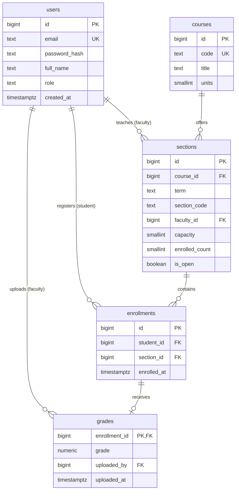

# Schema

```mermaid
erDiagram
    users ||--o{ sections : "teaches (faculty)"
    users ||--o{ enrollments : "registers (student)"
    users ||--o{ grades : "uploads (faculty)"
    courses ||--o{ sections : "offers"
    sections ||--o{ enrollments : "contains"
    enrollments ||--o| grades : "receives"

    users {
        bigint id PK
        text email UK
        text password_hash
        text full_name
        text role
        timestamptz created_at
    }

    courses {
        bigint id PK
        text code UK
        text title
        smallint units
    }

    sections {
        bigint id PK
        bigint course_id FK
        text term
        text section_code
        bigint faculty_id FK
        smallint capacity
        smallint enrolled_count
        boolean is_open
    }

    enrollments {
        bigint id PK
        bigint student_id FK
        bigint section_id FK
        timestamptz enrolled_at
    }

    grades {
        bigint enrollment_id PK, FK
        numeric grade
        bigint uploaded_by FK
        timestamptz uploaded_at
    }
```
